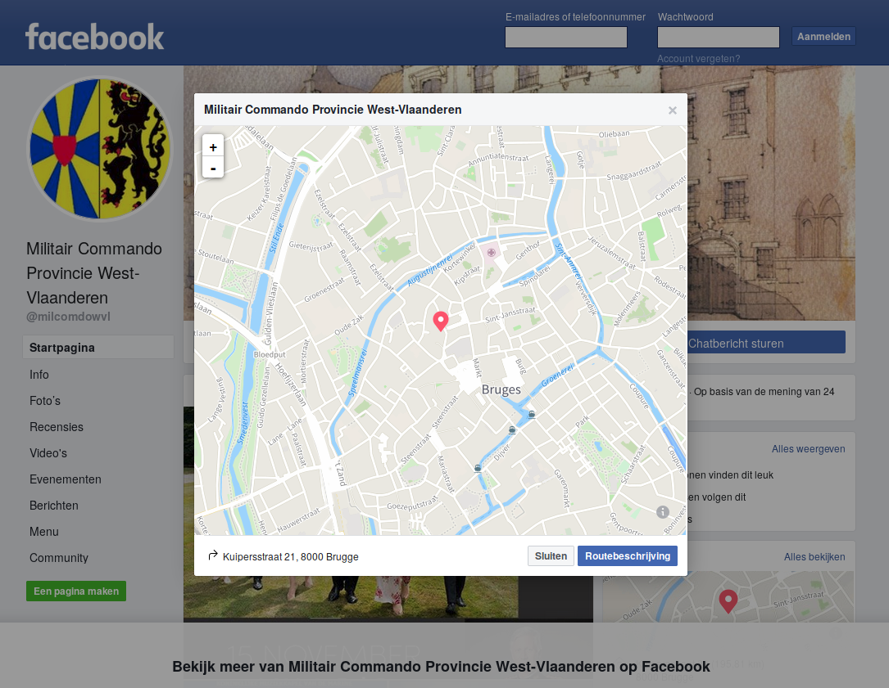
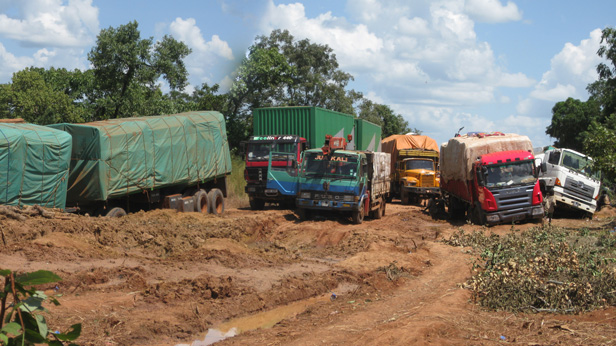
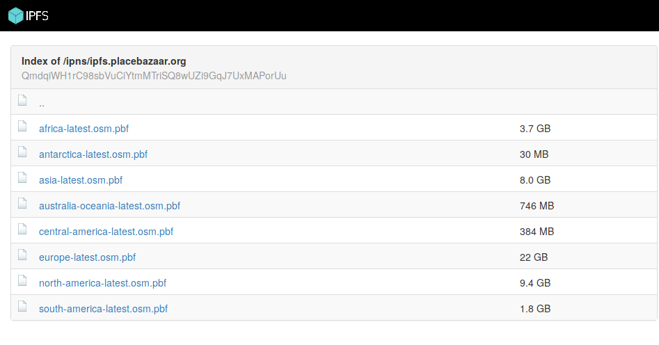
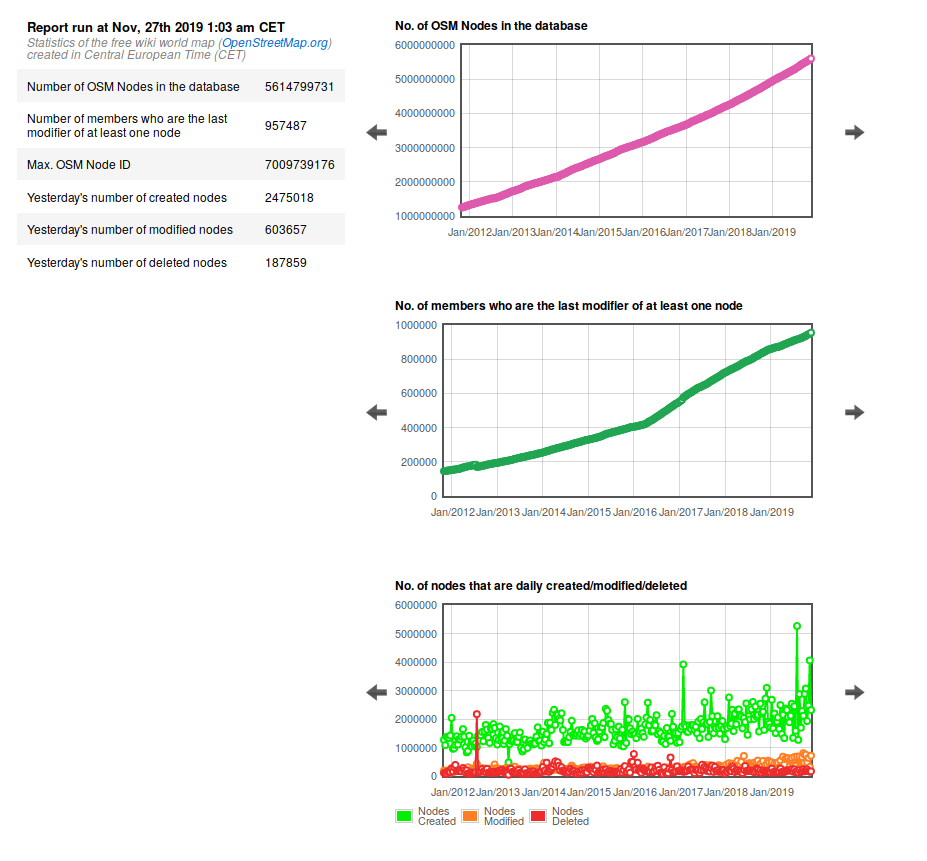
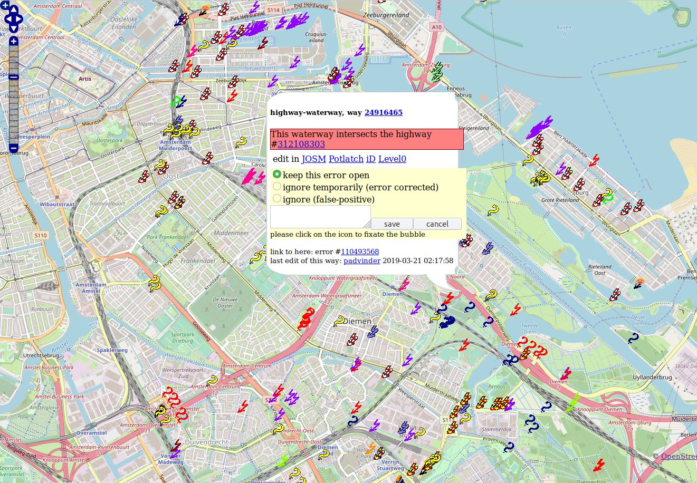
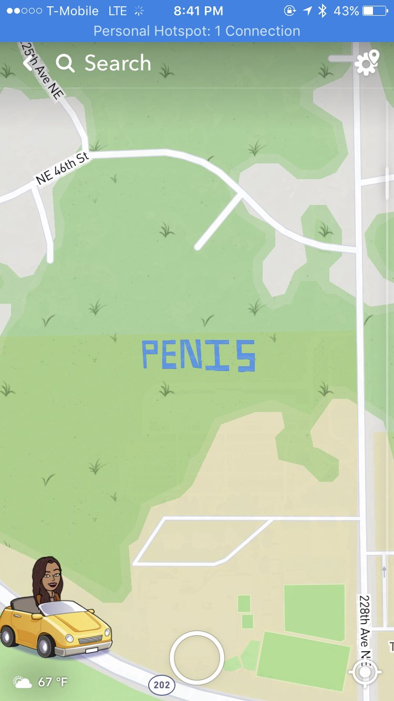
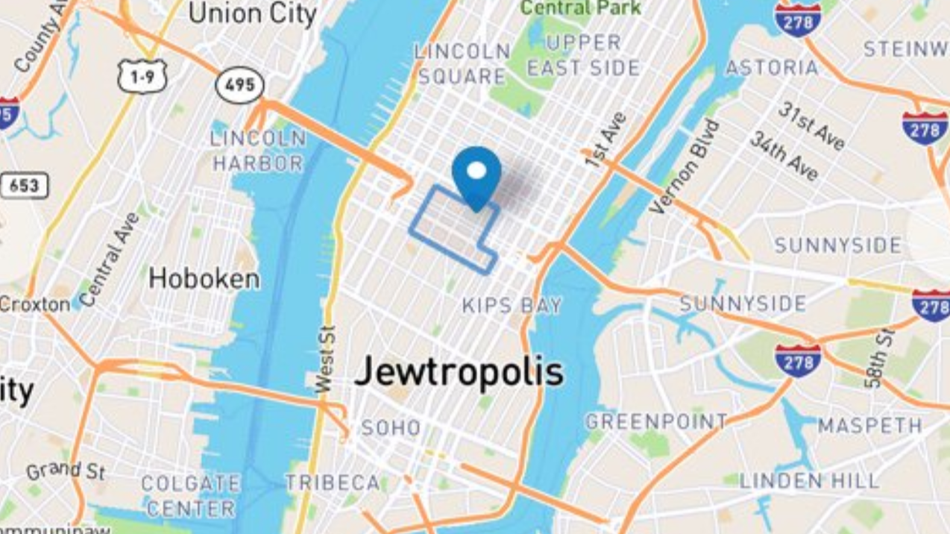
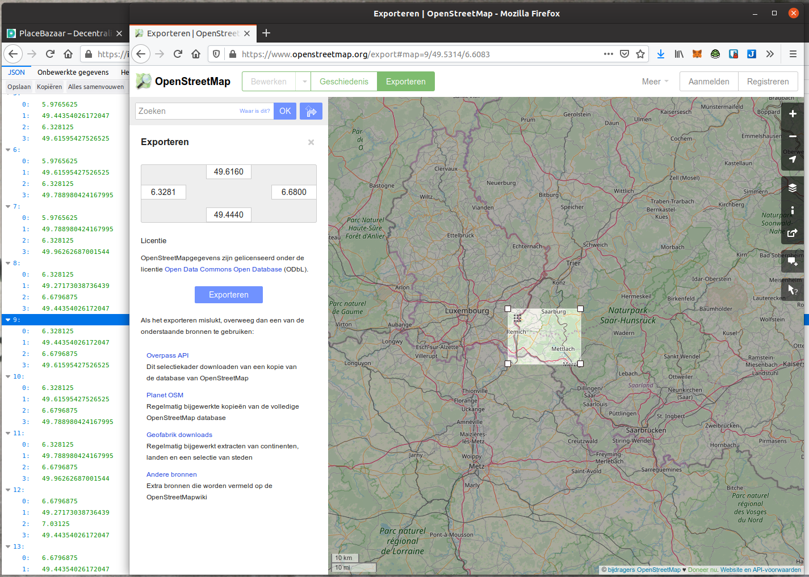
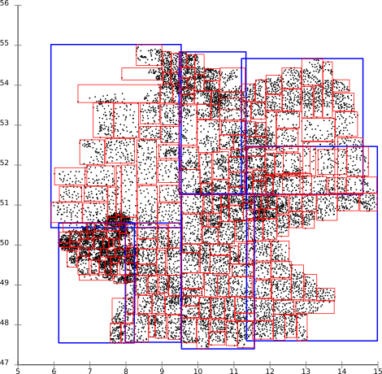

---
author:
  - Bèr `berkes` Kessels
title: Decentralised Mapping
subtitle: "A guide through the world of decentralized mapping projects"
abstract: "TODO"
keywords:
  - decentralised
  - mapping
  - presentation
  - placebazaar
lang: en
---

# About this pres

* Is online: [berk.es/mapping-fission](https://berk.es/mapping-fission) (git.webschuur.com/placebazaar/mapping-fission)
* Uses the word Blockchain only once ☚
* Uses the word Decentralised over Distributed, because Distribution
    means something different with mapping data.

# About me

* Bèr `berkes` Kessels
* berkes (berkes.eth, mastodon, keybase, github and that birdsite)
* Founder of placebazaar
* Blog on berk.es
* Mail on ber@berk.es

# we'll cover

* Problems with mapping
* Current solutions for mapping
* What can decentralisation offer?
* Deeper dive into one such solution: peermaps/ipfs.

# Problems

# Maps are expensive to make. { data-background-image="tomtomcars.jpg" }

They require local knowledge. Feet on the ground.

# Maps are always outdated.

The moment you publish a worldwide map, thousands of things have been
moved, renamed, replaced, closed, opened and so on.

# Maps are political and strategical.

Lots of pieces on a map are undebatable facts. 

> There is a park bench at X,Y.

# Maps are also debatable. { data-background-image="crimea.png" }

> This city is part of China/Israel/Thailand/Belgium

# Maps are often strategical { data-background-image="marine-parking.jpg" }

* Here's a military base with N parking spots.  
* This is where all the speed camera's are.  
* Here you can cross the border easily.  

# To summarise

* are hard and expensive to make and maintain.
* require local knowledge.
* are politically motivated and censored.
* are the last thing to put inside one monopolist.

# Maps are the most important visualisation of data.

When did you last use a map.

# Centralisation

# Centralisation enables censorship { data-background-image="censor.jpg" }

---

---

# Hampered by commercial interest { data-background-image="hairdresser.jpg" }

---

[... The 'Wikipedia Of Maps' Came To The Rescue ](https://www.npr.org/sections/goatsandsoda/2019/10/03/765783296/after-hurricane-dorian-the-wikipedia-of-maps-came-to-the-rescue?t=1575021420075)
---

# Enables privacy infringements

Google knows:

::: incremental
* Where you work, live, sport, spend free time.
* Where your boyfriend lives.
* That you no longer visit your boyfriend.
* When you quit your job.
* Visit the liquor store more often.
* Sleep on a bench.
:::

--- 

Google Location services, and the "free" google maps app, are
the biggest *trojan horse*. Deployed only to get the most valuable
metadata about you.

--- 

# Centralisation

* Easy to censor.
* Dependent on interest of central publisher.
* Runs on users' data (privacy)
* Monopoly.
* etc. The usual.

# Current mapping

* Google Maps
* Open Street Maps
* A bazillion GIS providers

--- 

[example](https://gspe21-ssl.ls.apple.com/html/attribution.html){target=_blank}

# There is mapping data.

* Lots of it is open data.
* Lots can be bought or licensed.
* But it is spread all over.
* And always in flux.

# Solution { data-background-image="oca-accra-field.jpg" }

* Decentralised collection of mapping data
* Decentralised publication of mapping data
* Entities and orgs glueing, and mixing all that data

# Current Options

* Google Business/maps
* Apple Maps
* Bing Maps
* Open Street Map

# Future options: Collection

* [FOAM](https://map.foam.space/#/at/?lng=4.8314700&lat=52.3445000&zoom=5.00)
* [StreetCred](https://www.streetcred.co/).
* [OSMand Live (Bitcoin Payments)](https://osmand.net/osm_live)
* Scamcoins galore
* Vaporware (including [PlaceBazaar](https://placebazaar.org/))

# Future options: Distribution

* [Peermaps](https://peermaps.org/)
* [Bittorrent](http://www.mantlik.cz/tracker/)
* [IPFS](https://cloudflare-ipfs.com/ipns/ipfs.placebazaar.org)

---

---

* Streaming

---

 [GTFS example](https://tracker.geops.ch/?z=14&s=1&x=547404.9479&y=6865272.5317&l=transport){target=_blank}.

--- 

# Dynamics of mapping data

1. Geography: continents, mountains, lakes
2. Physical structure: Roads, bridges, location of cities
3. Political: Boundaries, borders
4. Metadata: Speed limits, turn restrictions, park benches, restaurant
5. Logistics: traffic, transport

# Obstacles 

* Collection of data is complex.
* Data is continuously updating.
* Data is HUGE.

---

# Data is never "finished". Or 100% dependable.

--- 

--- 

{ height=600px }

--- 

# Data is everywhere (but unfindable).

--- 

[example](https://maps.amsterdam.nl/open_geodata/?k=278) { target=_blank }

# Standards

# Standards: just one example

::: incremental

* Netherlands requires Rijksdriehoekstelsel
* How many **official** Spatial reference systems are there? Guess?
* Nope: 4362 (in EPSG)

:::

# Mixing, Mashing and Merging is a problem.

# Decentralised

> Just because it is possible to build distributed systems does not
> necessarily mean that it is a good idea.
> *— Andrew S. Tanenbaum in Distributed Systems: Principles and Paradigms*

# Solutions by centralising

* Weekly/Nightly imports: just rebuild the database.
* Event stream, handle changesets. [example live updates](http://live.openstreetmap.fr/){ target=_blank }

# Solutions by centralising

* Central Quality Assurance (tools)
* Validation by crowd
* Effort orchestration
* Standards enforcement and -emergence.

# Solutions through decentralisation

# Breaking Monopolies?

* There's enough data. Open and Free.
* Data gathering of map-data is decentralised by nature.
* (Well there's satellite and AI).
* We need more interfaces around existing datasets. The read-side is
    not distributed.

# Breaking Censorship?

* On the read-side.
* Developers need more options (than Google maps).
* Developers need easier access to datasets.
* PlaceBazaar is building a PoC OpenOpeningsTijden; a business directory

# Taking back ownership?

* Any personal location data must be owned by users.
* Any other data must be open data.

# What can the decentralisation-movement do?

# Make apps.

(and make them privacy-first)

# Use apps.

OSMand, Maps.me, Or [one of the 160+
android](https://wiki.openstreetmap.org/wiki/Category:Android_software)
or [126 iOS
apps](https://wiki.openstreetmap.org/wiki/Category:IOS_software) using
open data maps.

# Use free mapping tools

* Display maps: Leaflet, OpenLayers
* In apps: Mapbox SDK, Skobbler, Nutitek, and many more
* Run your own tileserver: Mapnik and many more.
* Tune your own routing: GraphHopper, OpenTripPlanner, Brouter, Openrouteservice
* [And more usages](https://switch2osm.org/other-uses/)

# Release open data (yay! even more data)

# Peermaps

[example: luxembourg](https://ipfs.io/ipfs/QmfLkbAq6nhQmRccVUkrA6A1dRAni2QtomhcEGiv2D9aEm){ target=_blank }

# Storage

# R-tree

# Code.

    ssh kind-jefferys.webschuur.com
    peermaps data 6.3281,49.4440,6.6800,49.6160 | bat

    diff -u <(peermaps files 6.3281,49.4440,6.6800,49.6160) <(peermaps files 6.3281,49.0,6.6800,49.6160)

    peermaps data 6.3281,49.4440,6.6800,49.6160 | grep "fuel"

    peermaps data 5.4080,49.4137,7.5641,50.2235 | grep "fuel"
