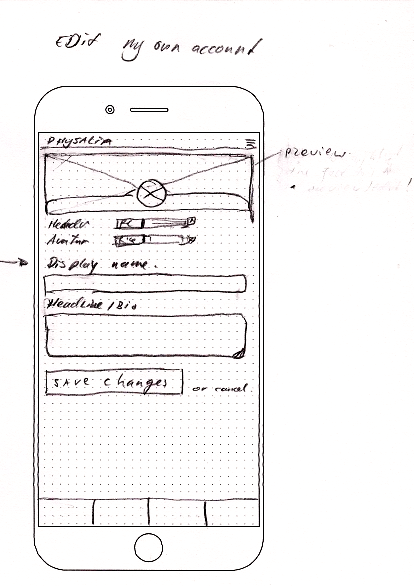
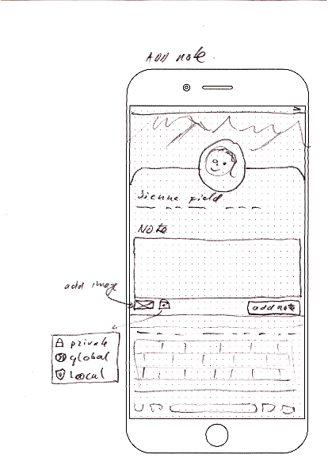
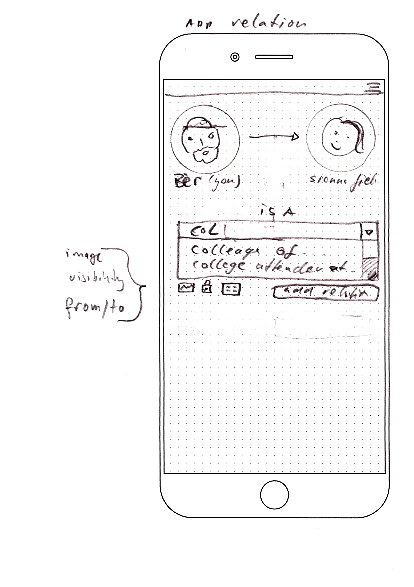
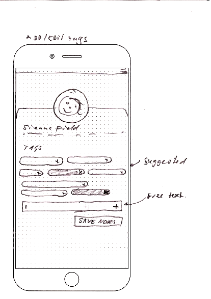

---
author:
  - Bèr `berkes` Kessels
title: Werktitel "Physalia"
subtitle: "Een decentrale LinkedIn"
abstract: "In deze pitch presenteer ik het plan om een Decentrale
           LinkedIn aan te wakkeren"
keywords:
  - pitch
  - fediverse
lang: nl
---

# You are the product

::: notes
 Linkedin heeft andere doelstellingen dan haar gebruikers: **gebruikers zijn het product**.
:::

# You are locked in

:::notes
**Privacy en eigenaarschap van data** op centrale netwerken als LinkedIn, zijn tegenstrijdigheden.
:::

# One-size-fits-all (Cultural imperialism)

:::notes
Linkedin past nooit precies bij alle demografiën.
:::

# Verder

* Linkedin kan **niet intern ingezet** worden in organisaties of netwerken.
* Linkedin is **onhandig als CRM**.

# Oplossing: Inleiding

<iframe width="560" height="315" sandbox="allow-same-origin allow-scripts" src="https://peertube.social/videos/embed/d9bd2ee9-b7a4-44e3-8d65-61badd15c6e6?subtitle=en&warningTitle=0" frameborder="0" allowfullscreen></iframe>

:::notes
* 00:00 - 3:34 - intro.

# Oplossing: Concreet

* Zakelijk Sociaal netwerk met zwaartepunt op **cooperatie** en onderlinge **relaties**.
* **Gedecentraliseerd: Federated, zelf-gehost**: Ieder netwerk een "server". 
* Gebruikers hebben interactie met elkaar over servers heen.

# Voordelen

* Ad-free.
* Privacy-focused.
* In-house inzetbaar.
* Voorspelbaar en simpel: geen algorithmes.
* Jou gegevens en attributen kunnen per netwerk verschillen.

# Vergezicht

* Een **Business-oriented** sociaal netwerk, met focus op **privacy** en **cooperatie**.
* Elke deelnemer kan het als **zijn eigen CRM** inzetten.
* Draai je eigen **intern sociaal network**.
* Jij bent de **eigenaar van je professioneel profiel**.
* Jij presenteert delen van jou professioneel profiel op allerlei diverse netwerken.

# Doelgroepen

* Mensen in de fediverse: privacy minded, bekend met decentralisatie.
* Deelnemers aan ZZP-, flexwerk- of ander zakelijke netwerken.
* Faciliteerders van zulke netwerken.

# Pysalia {data-background-image="physalia.jpg"}

> Het Portugees oorlogsschip (wetenschappelijke naam: Physalia physalis)
> is een complexe kolonie van honderden poliepen van vier typen.

# Eerste Halte

* Een fork van mastodon met een andere interface. Focus op 'deelnemers' en profiel. Social feed blijft bestaan.
* Je profiel bevat contactgegevens.
* Je profiel wordt een "resumé": Opleiding, Ervaring, Kennis etc.
* Je kan mensen "volgen" (social feed).
* Je kunt relaties naar anderen bijhouden: *"John worked with Anne from Jan to Oct for project X"*
* Je kunt personen taggen, en notities bijhouden op personen.

# Daarna richting (eindstation?):

---

---

---

---

---

---

---

# Business Model

* Hosting voor organisaties (€5 - €20/maand/instance)
* Maatwerk voor organisaties (€x/uur + hosting + €x/maand support)

# Groeiplan

* Open Source - Selfhosted: gratis
* Open Instance - flagship: gratis
* Hiermee: Advocates en Fediverse aan boord krijgen.
* Verkopen aan organisaties

# Terminologie uitgelegd:

* Zichtbaarheid
* Compontenten
* Relaties

---

---

---

